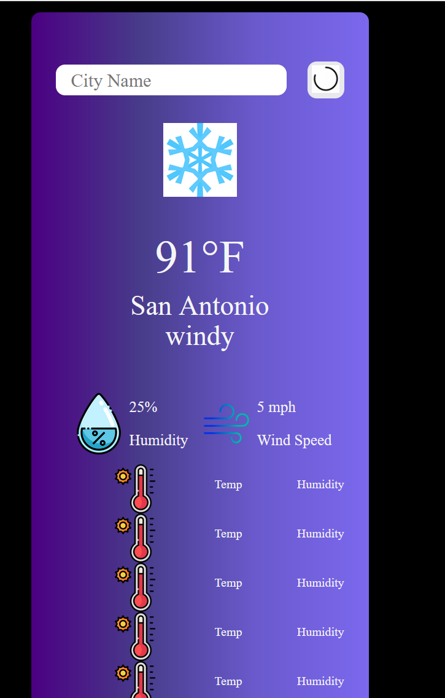
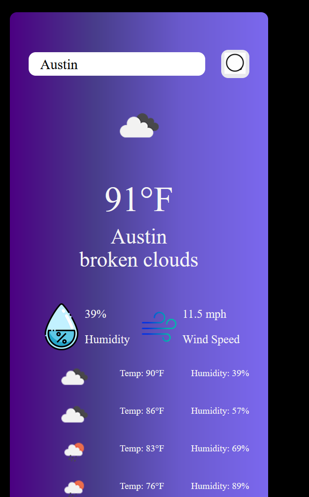

# Challenge_6_Weather_Dashboard

## Description

for module 6 I created a weather dashboard.  The dashboard has the ability to be searched by city and provides
a five day forcast for that city.  when a city is chosen the weather icons change with the weather.

## Installation

click the link to open app: https://anthonystrickland.github.io/Challenge_6_Weather_Dashboard/

## Usage
default page of the weather dashboard

live page of the weather dashboard

## Credits

https://github.com/kittykatt210?tab=repositories

UTSA Bootcamp

https://icons8.com/icons/set/search-button

https://www.w3schools.com/css/css3_gradients.asp

https://www.chai3d.org/download/doc/html/chapter14-colors.html

https://www.flaticon.com/free-icons/weather-forecast

<a href="https://www.flaticon.com/free-icons/weather" title="weather icons">Weather icons created by Freepik - Flaticon</a>
https://home.openweathermap.org/

